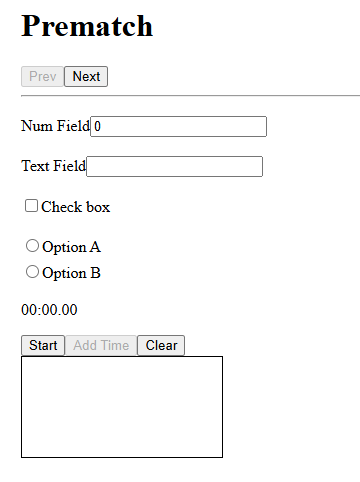
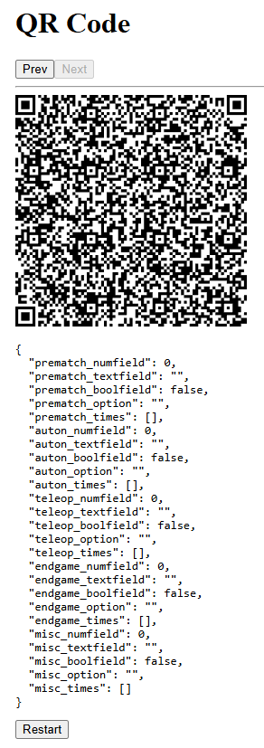
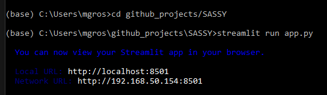
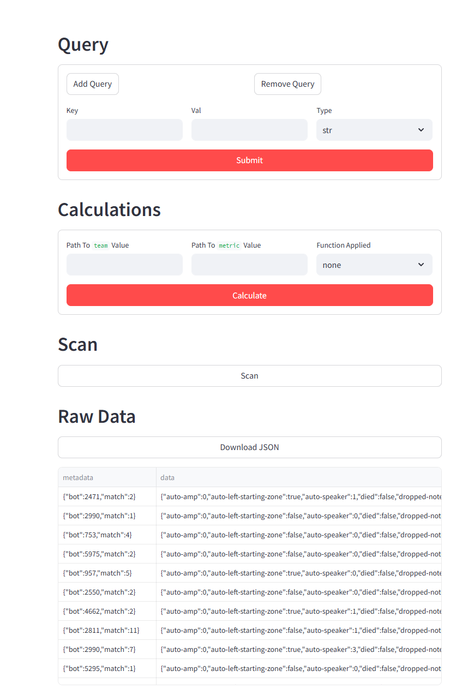
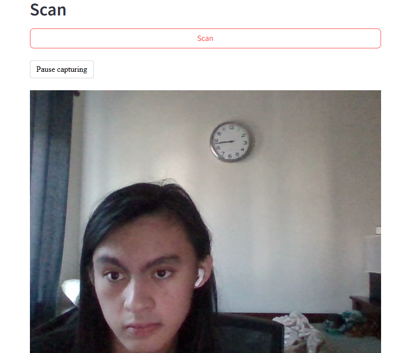
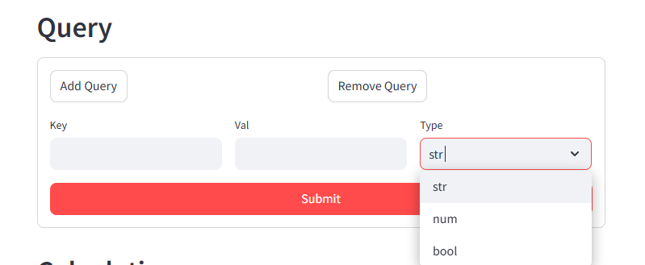
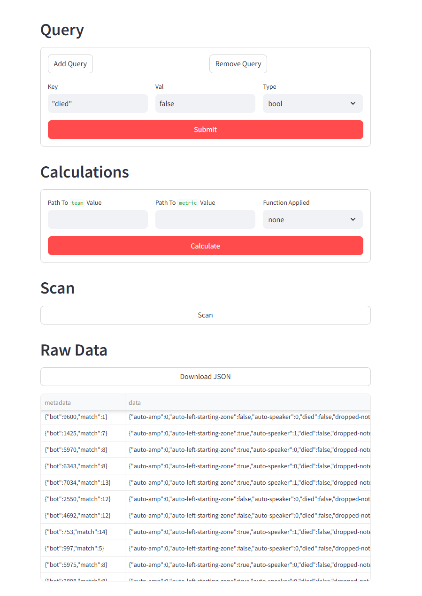
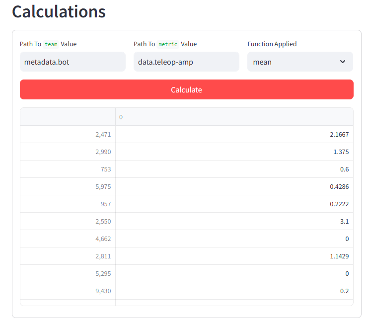

# SASSY

SASSY is a scouting app. It has 2 parts, a frontend similar to ScoutingPASS, with configs, meant to collect data, and a host end, with variours calculations and queries to complement data storage. Data is tranferred via qr code

# SASSY Frontend

A scouting site generator.

## Features

## Installation

This project requires NodeJS of at least version 18 or higher to work. If you do not have it installed, please install it [here](nodejs.org).

#### 1) Open the command prompt

##### Windows

Open the start menu and type `cmd` into the search bar. Click it or press enter.

##### MacOS

Open the search bar (⌘Space). Type in `terminal` and press enter.

#### 2) Cloning the repository

If you have Git installed, enter the following command into the command line. If you do not have it, [install it](https://git-scm.com/downloads).

```shell
git clone https://github.com/mrosal-12/SASSY
```

A new folder has been created at your current directory, named `SASSY`. This folder contains the repository and all of the files above.

#### 3) Install dependencies

You must be within the correct directory and have NodeJS installed (version 18 or higher) for this step to work.

To check which version you have installed, enter the following command:
```shell
node --version
```

Change your directory to the SASSY frontend, which is where the site generation code resides.
```shell
cd SASSY/frontend
```

Install project dependencies.
```shell
npm install
```

All the files you need should now be on your computer. It should look like this:

If everything is working correctly, you can now view the demo site.

Try this:
```shell
npm run dev
```

This command will start the development server. If you enter the provided URL into your browser (it should look like `http://localhost:xxxx`), it will display the site with the default configuration.

Your command prompt window will be stuck running the server, but you can still interact with it. Type in `h` and press enter to see what you can do. Enter in `q` to quit and go back to the command prompt.

#### 4) Interacting with the command line interface

There are other things you can do with the command prompt. To see a list of all commands now available, use the following command:
```shell
npm run
```

Some of these commands have to be stopped manually. You may stop a program from the command line at any time by performing an an interrupt (Ctrl+C).

List of commands:

`npm run dev` starts the development server. The current folder is watched for changes made and the content served at a local URL is updated accordingly.

`npm run build` generates the site in the `dist` folder. The folder is created if it does not exist.

`npm run watch` starts a process that watches for changes. If any change is made, the site is generated again automatically in the `dist` folder.

`npm run preview` starts a development server, but the content served at the local URL is from the `dist` folder.

#### 5) Configuring the site

Much of the site can be configured using the `config.json` file.

First, open `config.json` in a text editor of your choice. There are several options shown below.

---

##### Windows Commands

`start .` opens the current folder in File Explorer. Open `config.json` with a text editor.

`notepad config.json` opens `config.json` in Notepad.

##### MacOS Commands

`open .` opens the current folder in Finder. Open `config.json` with a text editor.

`open -e config.json` opens `config.json` in TextEdit.

---

Next, start the development server.

```shell
npm run dev
```

Type in `o` and press enter. It will open the site in your browser.

Any changes made to `config.json` will now make changes to the site, as long as the development server is running.

#### 6) Configuration Overview

The contents of `config.json` are written in [JSON](https://json.org). It should look something like this:

```js
{
  "pages": [
    ...
  ]
}
```

This top object represents the site, which has a list of pages.

The site itself consists of several configurable pages. Except for the last page, which is separate and not configurable.

Each of these pages is ordered from first to last, and are represented by objects of their own.

```js
{
  "title": "Example Title",
  "fields": [
    ...
  ]
}
```
Every page has a title, and several fields for a user to input data.

These fields are also objects.

There are five different different types of fields: `number`, `text`, `checkbox`, `radio`, and `timer`.

```js
{
  "name": "example_internal_name1",
  "label": "Example Number Field Label",
  "input": "number"
}
```

```js
{
  "name": "example_internal_name2",
  "label": "Example Text Field Label",
  "input": "text"
}
```

```js
{
  "name": "example_internal_name3",
  "label": "Example Thing to Check",
  "input": "checkbox"
}
```

```js
{
  "name": "example_internal_name4",
  "input": "radio",
  "options": [ ... ]
}
```

```js
{
  "name": "example_internal_name5",
  "input": "timer"
}
```

Every field has a name, which is its name in the JSON object provided on the last page.

Every field has an input type, which tells the code what kind of field to use.

The `number`, `text`, and `checkbox` fields all have a label associated with them.

The `radio` field uniquely has a list of options. Each option is a string. There should be at least one option in this list.


#### 7) Generating the site

You can generate the site using `npm run build`. This will put all the files needed to run the site into the `dist` folder. This folder may not exist yet, but should be created when you run the command.

This folder is the one you need to deploy your site.

You may copy these files to a server. Your web server just needs to be able to serve the files from this folder.

You can run this site on other devices if they are all on the same wifi network. to do this, use the following url:
http://{a}:{b}, where {a} is the ip address of the device hosting this, while {b} is the port number (the number left of localhost in the http address when you run it via npm)

In order to cancel it, press `ctrl-c` in the terminal, then enter `Y`

#### Example:
With default configs, you should see this:


Like in ScoutingPASS, the form has 5 sections, one for each period of the game (Prematch, Auto, Teleop, Endgame, and Postgame). You can adjust what fields are here in the configs

The end of form should have this screen:


It has the qrcode you need to scan and the raw data it outputs

## SASSY Host

In order to run the code, make sure you have the `streamlit`, `camera-input-live`, `qreader`, and `opencv` packages downloaded.

To download the package, run the following command:
```console
> pip install streamlit
> pip install streamlit-camera-input-live
> pip install opencv-python
> pip install qreader
```

Once the streamlit package is downloaded, run the program with the following command:
```console
> streamlit run app.py
```

This should open up a new browser window where the program will be ran. If it worrks, the console will say this:

And the browser will have thsi tab:


**Note**: while the program runs in a browser window, it is still locally hosted and does not require internet connection.

You can add new data with the "scan" function. When scanning for a qrcode, it will use your webcam, and look smoething like this:

It will stop scanning once it finds a qr code, or when you hit the scan button again.

If you want to limit data, use the query function too filter out undesirable results:



**Note**: Make sure to add in the quotation marks on the key, as it will not wokr without them

Finally, get results with the calculations feature:

If you just want raw data, select "none." otherwise, select the function you want
The syntaxt for entries is [data/metadata].[field]. In this example, I want to look for team numbers. "Bot" gives me that, and its in the metadata field, so I put metadata.bot


## End
Now that you're done, mess around with the configs and clear out test_data.json in order to make your own!